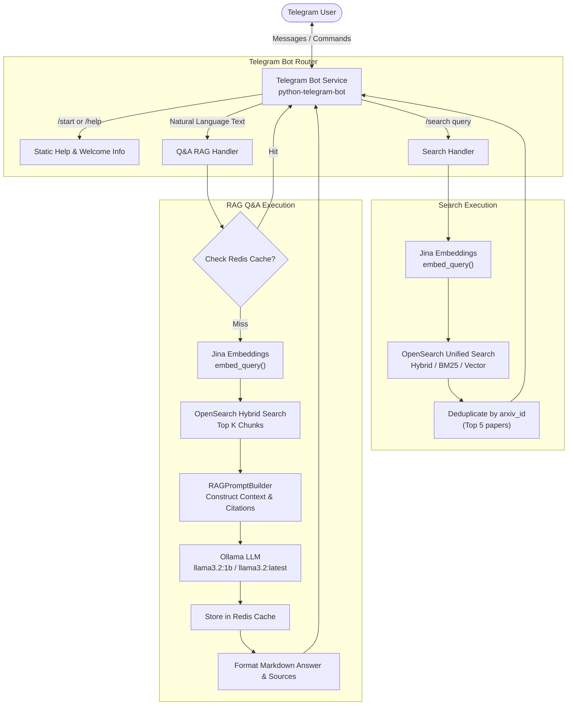

# Telegram Bot Integration & Architecture Guide

This document describes the **Telegram Bot** service in the **arXiv Paper Curator** RAG system. The bot provides a conversational chat interface for researchers to query computer science arXiv papers, perform hybrid keyword/semantic paper searches, and receive LLM-synthesized answers with direct citations.

---

## Table of Contents

- [1. Overview & Key Capabilities](#1-overview--key-capabilities)
- [2. Architecture & Request Flow](#2-architecture--request-flow)
- [3. Supported Commands & Handlers](#3-supported-commands--handlers)
  - [`/start`](#start)
  - [`/help`](#help)
  - [`/search <keywords>`](#search-keywords)
  - [Natural Language Question Answering](#natural-language-question-answering)
- [4. Configuration](#4-configuration)
  - [Environment Variables](#environment-variables)
  - [Pydantic Configuration Class](#pydantic-configuration-class)
  - [Obtaining a Telegram Bot Token](#obtaining-a-telegram-bot-token)
  - [Helm / Kubernetes Deployment Configuration](#helm--kubernetes-deployment-configuration)
- [5. Component Implementation](#5-component-implementation)
  - [Service Factory (`make_telegram_service`)](#service-factory-make_telegram_service)
  - [Bot Core (`TelegramBot`)](#bot-core-telegrambot)
  - [Lifecycle Management (`start` / `stop`)](#lifecycle-management-start--stop)
  - [Cache Integration](#cache-integration)
  - [Hybrid Search & Deduplication](#hybrid-search--deduplication)
  - [RAG Answer Generation & Safe Markdown Delivery](#rag-answer-generation--safe-markdown-delivery)
- [6. How to Run the Bot](#6-how-to-run-the-bot)
  - [Option A: Standalone Runner Script](#option-a-standalone-runner-script)
  - [Option B: Integration in FastAPI Lifespan](#option-b-integration-in-fastapi-lifespan)
- [7. Error Handling & Edge Cases](#7-error-handling--edge-cases)
- [8. Troubleshooting & FAQ](#8-troubleshooting--faq)

---

## 1. Overview & Key Capabilities

The Telegram Bot service connects Telegram users directly with the arXiv Paper Curator RAG backend using [`python-telegram-bot`](https://python-telegram-bot.org/) (v21 async API).

### Key Features

- **End-to-End RAG Q&A**: Answers natural language research questions using retrieved arXiv chunk context and local LLM inference via Ollama (`llama3.2:1b` / `llama3.2:latest`).
- **Hybrid Paper Search (`/search`)**: Combines BM25 keyword matching and dense vector embeddings (via Jina AI) powered by OpenSearch's Reciprocal Rank Fusion (RRF) pipeline.
- **Source Citation & Direct Links**: Automatically formats source links to arXiv paper abstract pages (`https://arxiv.org/abs/{arxiv_id}`) and PDF downloads.
- **Response Caching**: Integrates with Redis (`CacheClient`) to serve cached answers instantly for repeated questions.
- **Typing Indicators**: Sends interactive `typing` chat actions to inform users that search or LLM generation is underway.
- **Safe Markdown Rendering**: Attempts formatted Markdown delivery and gracefully falls back to plain text if Telegram Markdown parsing encounters formatting conflicts.

---

## 2. Architecture & Request Flow

The following diagram illustrates how the Telegram Bot interacts with the rest of the arXiv Paper Curator ecosystem:



---

## 3. Supported Commands & Handlers

The bot handlers are registered in `src/services/telegram/bot.py` via `telegram.ext`:

### `/start`

Initializes interaction with the bot and displays a welcome banner with available commands.

**Response:**

```text
Welcome to arXiv Paper Curator!

Ask me questions about CS papers and I'll provide answers with sources.

Commands:
/help - Show this help
/search <keywords> - Search papers
```

---

### `/help`

Provides guidance on asking questions and lists example queries.

**Response:**

```text
Send me any question about computer science research papers.

Examples:
- What are transformer architectures?
- How does BERT work?
- Explain attention mechanisms

Use /search to find specific papers.
```

---

### `/search <keywords>`

Executes unified hybrid search against indexed paper chunks in OpenSearch.

**Workflow:**

1. Validates that search keywords were provided. If omitted, sends usage instructions (`Usage: /search <keywords>`).
2. Sends the `typing` chat action to the Telegram chat.
3. Generates a query embedding via `embeddings_client.embed_query(query)`.
4. Queries OpenSearch using `opensearch_client.search_unified(query=query, query_embedding=query_embedding, size=10, use_hybrid=True)`.
5. Deduplicates hits by `arxiv_id` to prevent repeated paper titles from multiple chunks of the same paper, returning up to 5 unique papers.
6. Formats paper titles and URLs (`https://arxiv.org/abs/{arxiv_id}`).
7. Sends the response with `disable_web_page_preview=True`.

---

### Natural Language Question Answering

Any non-command text message triggers the RAG question answering pipeline:

**Workflow:**

1. Builds an `AskRequest(query=query, top_k=3, use_hybrid=True)`.
2. **Cache Lookup**: If Redis cache is configured, checks `cache.find_cached_response(ask_request)`. If found, delivers the cached answer immediately.
3. **Retrieval**: Generates query embeddings with Jina and queries OpenSearch for the top 3 relevant chunks.
4. **Context Construction**: Formats context blocks with citations using `RAGPromptBuilder`.
5. **Generation**: Invokes Ollama (`ollama.generate(model="llama3.2:1b", prompt=prompt, stream=False)`).
6. **Cache Storage**: Stores the generated response in Redis for subsequent queries.
7. **Delivery**: Formats the answer and source links and replies to the user.

---

## 4. Configuration

The Telegram Bot is configured through environment variables managed by Pydantic Settings.

### Environment Variables

Add the following variables to your `.env` file:

```bash
# Telegram Bot Configuration
TELEGRAM__ENABLED=true
TELEGRAM__BOT_TOKEN=1234567890:ABCdefGHIjklMNOpqrSTUvwxYZ
```

| Variable              | Type   | Default | Description                                    |
| :-------------------- | :----- | :------ | :--------------------------------------------- |
| `TELEGRAM__ENABLED`   | `bool` | `false` | Enable or disable the Telegram bot service.    |
| `TELEGRAM__BOT_TOKEN` | `str`  | `""`    | The HTTP API bot token issued by `@BotFather`. |

### Pydantic Configuration Class

Defined in [`src/config.py`](/src/config.py):

```python
class TelegramSettings(BaseConfigSettings):
    model_config = SettingsConfigDict(
        env_file=[".env", str(ENV_FILE_PATH)],
        env_prefix="TELEGRAM__",
        extra="ignore",
        frozen=True,
        case_sensitive=False,
    )

    bot_token: str = ""
    enabled: bool = False
```

The settings are accessible on the root configuration object:

```python
from src.config import get_settings

settings = get_settings()
is_enabled = settings.telegram.enabled
token = settings.telegram.bot_token
```

### Obtaining a Telegram Bot Token

1. Open Telegram and search for `@BotFather`.
2. Send `/newbot` and follow the prompts to choose a display name and username (must end in `bot`, e.g., `arxiv_paper_curator_bot`).
3. Copy the HTTP API token provided by BotFather.
4. Paste the token into `TELEGRAM__BOT_TOKEN` in your `.env` file.

### Helm / Kubernetes Deployment Configuration

In Kubernetes deployments, the token can be set via Helm values in [`helm/arxiv-paper-rag/values.yaml`](helm/arxiv-paper-rag/values.yaml):

```yaml
external:
  telegram:
    botToken: "" # Injected as TELEGRAM__BOT_TOKEN secret
```

And mapped into the container environment via [`helm/arxiv-paper-rag/templates/secret.yaml`](helm/arxiv-paper-rag/templates/secret.yaml):

```yaml
TELEGRAM__BOT_TOKEN: { { .Values.external.telegram.botToken | quote } }
```

---

## 5. Component Implementation

### Service Factory (`make_telegram_service`)

Located in [`src/services/telegram/factory.py`](src/services/telegram/factory.py). Responsible for reading settings, validating the token, and instantiating `TelegramBot`:

```python
def make_telegram_service(
    opensearch_client,
    embeddings_client,
    ollama_client,
    cache_client=None,
    langfuse_tracer=None,
) -> Optional[TelegramBot]:
    settings = get_settings()

    if not settings.telegram.enabled:
        logger.info("Telegram bot is disabled")
        return None

    if not settings.telegram.bot_token:
        logger.warning("Telegram bot token not configured")
        return None

    bot = TelegramBot(
        bot_token=settings.telegram.bot_token,
        opensearch_client=opensearch_client,
        embeddings_client=embeddings_client,
        ollama_client=ollama_client,
        cache_client=cache_client,
    )

    logger.info("Telegram bot created successfully")
    return bot
```

---

### Bot Core (`TelegramBot`)

Located in [`src/services/telegram/bot.py`](src/services/telegram/bot.py):

```python
class TelegramBot:
    """Simple Telegram bot for Q&A."""

    def __init__(
        self,
        bot_token: str,
        opensearch_client,
        embeddings_client,
        ollama_client,
        cache_client=None,
    ):
        self.bot_token = bot_token
        self.opensearch = opensearch_client
        self.embeddings = embeddings_client
        self.ollama = ollama_client
        self.cache = cache_client
        self.application: Optional[Application] = None
```

---

### Lifecycle Management (`start` / `stop`)

The bot operates asynchronously using long polling:

```python
async def start(self) -> None:
    """Start the bot."""
    logger.info("Starting Telegram bot...")
    self.application = Application.builder().token(self.bot_token).build()

    # Register command and message handlers
    self.application.add_handler(CommandHandler("start", self._start_command))
    self.application.add_handler(CommandHandler("help", self._help_command))
    self.application.add_handler(CommandHandler("search", self._search_command))
    self.application.add_handler(
        MessageHandler(filters.TEXT & ~filters.COMMAND, self._handle_question)
    )

    # Initialize, start application, and start polling updates
    await self.application.initialize()
    await self.application.start()
    await self.application.updater.start_polling()
    logger.info("Telegram bot started successfully")

async def stop(self) -> None:
    """Stop the bot."""
    if self.application:
        await self.application.updater.stop()
        await self.application.stop()
        await self.application.shutdown()
        logger.info("Telegram bot stopped")
```

---

### Cache Integration

Before performing embedding generation and vector search, `_handle_question` checks the Redis cache:

```python
ask_request = AskRequest(query=query, top_k=3, use_hybrid=True)

if self.cache:
    try:
        cached_response = await self.cache.find_cached_response(ask_request)
        if cached_response:
            await self._send_answer(update, cached_response)
            return
    except Exception as e:
        logger.warning(f"Cache lookup failed: {e}")
```

When a fresh answer is generated by Ollama, it is cached for subsequent queries:

```python
if self.cache:
    try:
        await self.cache.store_response(ask_request, response)
    except Exception:
        pass
```

---

### Hybrid Search & Deduplication

When searching papers via `/search`, multiple chunks can originate from the same paper. The bot deduplicates results by `arxiv_id` and takes the top 5 unique papers:

```python
hits = results.get("hits", [])
seen_ids = set()
unique_papers = []
for hit in hits:
    arxiv_id = hit.get("arxiv_id", "")
    if arxiv_id and arxiv_id not in seen_ids:
        seen_ids.add(arxiv_id)
        unique_papers.append(hit)
    if len(unique_papers) >= 5:
        break
```

---

### RAG Answer Generation & Safe Markdown Delivery

Answers generated by Ollama are formatted with citations:

```python
async def _send_answer(self, update: Update, response: AskResponse) -> None:
    """Send formatted answer to user."""
    message = f"*Answer:*\n{response.answer}\n"

    if response.sources:
        message += "\n*Sources:*\n"
        for idx, source_url in enumerate(response.sources[:5], 1):
            arxiv_id = source_url.split("/")[-1].replace(".pdf", "")
            message += f"{idx}. https://arxiv.org/abs/{arxiv_id}\n"

    # Try sending with Markdown formatting, fallback to plain text if parsing fails
    try:
        await update.message.reply_text(
            message, parse_mode="Markdown", disable_web_page_preview=True
        )
    except Exception:
        await update.message.reply_text(message, disable_web_page_preview=True)
```

---

## 6. How to Run the Bot

### Option A: Standalone Runner Script

A dedicated runner script is located at [`src/services/telegram/run.py`](src/services/telegram/run.py).

To start the Telegram bot service standalone:

```bash
# Run with Python module syntax
python -m src.services.telegram.run

# Or run the script file directly
python src/services/telegram/run.py
```

The script initializes OpenSearch, Jina embeddings, Ollama, Redis cache, and Langfuse tracing, registers signal handlers (`SIGINT`/`SIGTERM`) for graceful teardown, and starts polling Telegram updates.

---

### Option B: Integration in FastAPI Lifespan

The bot can run concurrently with the FastAPI web application inside the lifespan handler in [`src/main.py`](src/main.py):

```python
from src.services.telegram.factory import make_telegram_service

@asynccontextmanager
async def lifespan(app: FastAPI):
    # ... existing initialization ...
    telegram_bot = make_telegram_service(
        opensearch_client=app.state.opensearch_client,
        embeddings_client=app.state.embeddings_service,
        ollama_client=app.state.ollama_client,
        cache_client=app.state.cache_client,
    )
    app.state.telegram_bot = telegram_bot
    if telegram_bot:
        await telegram_bot.start()

    yield

    # Cleanup on shutdown
    if getattr(app.state, "telegram_bot", None):
        await app.state.telegram_bot.stop()
```

---

## 7. Error Handling & Edge Cases

| Scenario                         | Handling Mechanism                                                            | User Experience                                                                   |
| :------------------------------- | :---------------------------------------------------------------------------- | :-------------------------------------------------------------------------------- |
| **Empty Search Args**            | Checks `if not context.args`                                                  | Displays usage instructions: `Usage: /search <keywords>`                          |
| **No Papers Found**              | Checks if result hits / chunks are empty                                      | Returns helpful prompt: `No relevant papers found. Try rephrasing your question.` |
| **Embedding Generation Failure** | Caught via `try...except` block; falls back to BM25-only search in OpenSearch | Still provides keyword-based results without crashing                             |
| **Markdown Syntax Error**        | `_send_answer` catches `telegram.error.BadRequest`                            | Automatically resends answer in plain unformatted text                            |
| **Cache Down or Redis Error**    | Redis operations are isolated in `try...except`                               | Bot continues through normal RAG pipeline seamlessly                              |
| **Network or Ollama Failure**    | Outer exception handler logs stack trace                                      | Informs user with error message: `Error: <error details>`                         |

---

## 8. Troubleshooting & FAQ

### 1. `Telegram bot token not configured` or `Telegram bot is disabled`

- Ensure `TELEGRAM__ENABLED=true` is set in your `.env` file.
- Verify that `TELEGRAM__BOT_TOKEN` contains a valid token string from `@BotFather`.
- Check that the environment prefix `TELEGRAM__` matches (note the double underscore).

### 2. `Conflict: terminated by other getUpdates request`

- This occurs when more than one process or server instance attempts to poll Telegram using the exact same bot token.
- Ensure only one instance of the Telegram bot is running at a time. If running in Kubernetes, configure `replicaCount: 1` or run as a dedicated worker.

### 3. OpenSearch or Ollama connection timeouts

- Verify OpenSearch is healthy at `http://localhost:9200`.
- Verify Ollama is running and has the model installed:
  ```bash
  curl http://localhost:11434/api/tags
  ```
- If using `llama3.2:latest` instead of `llama3.2:1b`, adjust the model parameter in `_handle_question` or configure it in `Settings`.

### 4. Links in Telegram show large link previews

- Link previews are explicitly suppressed using `disable_web_page_preview=True` to keep chat messages clean and readable.

---

## Related Documentation

- [FastAPI Dependencies (`dependencies.md`)](docs/dependencies.md)
- [OpenSearch Hybrid Search Pipeline (`Understanding_Hybrid_Search_Pipeline_Opensearch.md`)](docs/Understanding_Hybrid_Search_Pipeline_Opensearch.md)
- [Bearer Token Middleware (`bearer_token_middleware.md`)](docs/bearer_token_middleware.md)
- [Langfuse Tracing (`langfuse_tracing.md`)](docs/langfuse_tracing.md)
